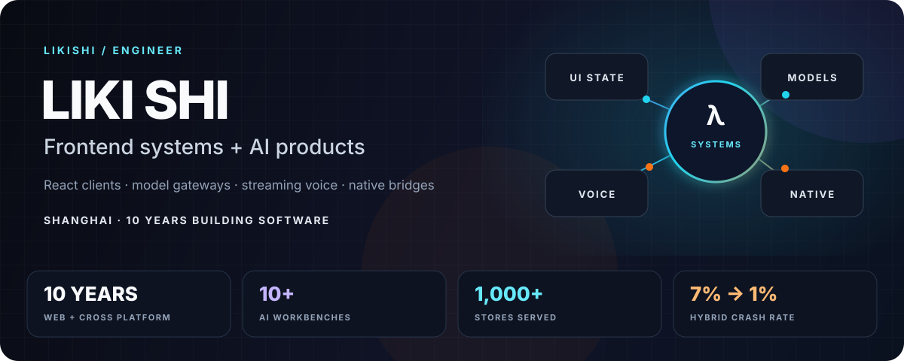
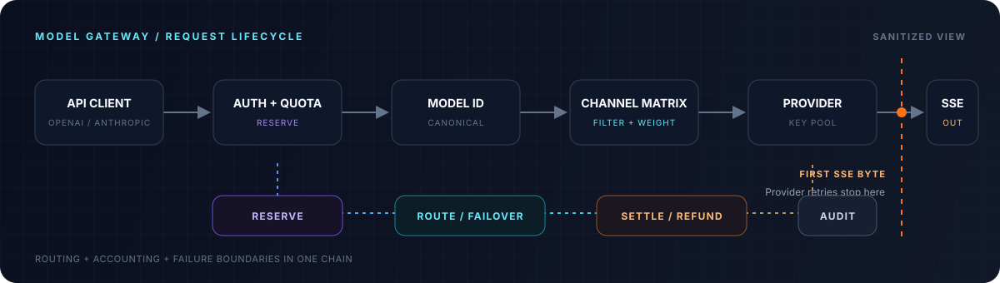

  

  
  

I have spent ten years building web and cross-platform products. These days I work on model gateways, streaming voice, tool state and native bridges.

I like boundary problems. Recent examples include stopping gateway retries before the first SSE chunk and validating data as it crosses from a Chrome 95 WebView into Kotlin.

十年前端与跨端经验。现在主要做 AI 应用、模型网关、实时语音和车载端集成。

## Systems I can talk about

I keep most current work in private repos and describe the implementation details I can share.

### 01 / Multi-model gateway

`React` `TypeScript` `Go` `MySQL` `Redis` `SSE`

I am building two React apps and the Go API behind them. I use one routing, quota, billing and settlement path for six operation types. The router can change providers until the first SSE chunk; after that point it keeps the active stream so users do not receive duplicate output or charges.

  

<table>
  <tr>
    <td width="50%" valign="top">
      <h3>02 / In-vehicle payment agent</h3>
      
<code>React</code> <code>Capacitor</code> <code>Kotlin</code> <code>WebSocket</code>

      
I built the client around wake-word detection, streaming speech and typed tool results. I validate the WebView bridge with Zod before Android starts a biometric payment or navigation request. I cover the app with 139 TS/TSX and 49 Android test files across four environments.

    </td>
    <td width="50%" valign="top">
      <h3>03 / Voice-driven digital human</h3>
      
<code>React</code> <code>Tauri</code> <code>Three.js</code> <code>Live2D</code>

      
I reuse one React business layer across web, desktop and mobile clients. I put the Live2D and VRM runtimes behind an <code>IRenderer</code> interface. I split full-duplex audio, provider fallback and network measurements across five packages.

    </td>
  </tr>
</table>

## Working set

  

  Shanghai, China 
  <a href="mailto:xllily.slikij@gmail.com">Email</a> · <a href="https://xllily.github.io">Blog</a>

